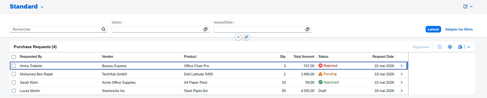
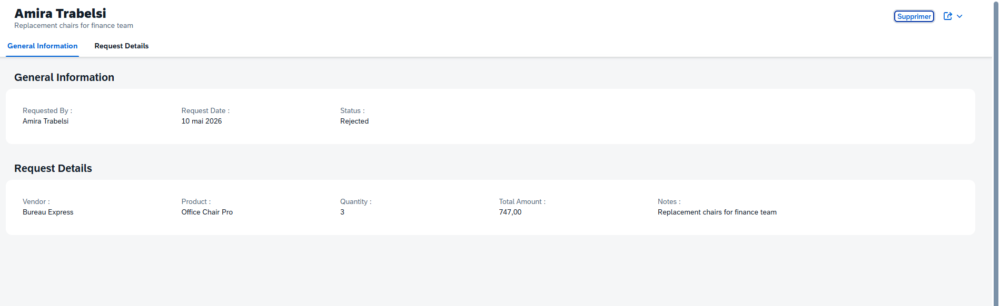
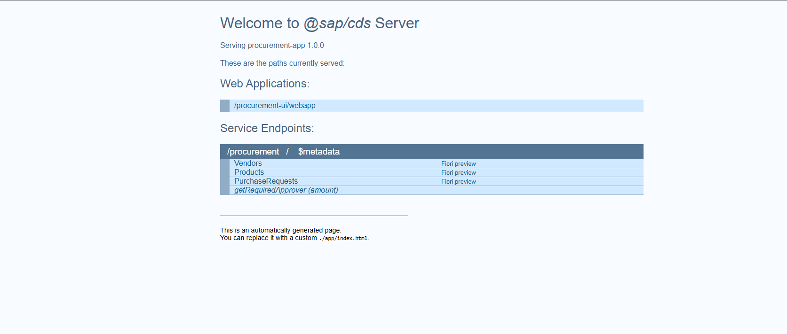

# SAP BTP Procurement Approval App

A full **side-by-side extension application** built on SAP Business Technology Platform (BTP) modeling a **Procure-to-Pay (P2P) approval workflow**. The app demonstrates the classic SAP BTP architecture pattern: a CAP backend with HANA-compatible persistence, a Fiori Elements frontend, and business logic enforced server-side.

## ✨ Features

- **Master Data Management** — Vendors, Products, and Purchase Requests with proper relational associations
- **Threshold-based approval routing** — `< $1k` auto-approved, `< $5k` Manager approval, `≥ $5k` Director approval
- **Server-side `totalAmount` calculation** — never trust the client; price × quantity is computed in CAP handlers
- **Status lifecycle state machine** — `Draft → Pending → Approved/Rejected → Ordered → Received → Closed` with illegal transitions blocked
- **3 custom OData actions** — `submit()`, `approve()`, `reject(reason)` bound to PurchaseRequests entity
- **Read-only helper function** — `getRequiredApprover(amount)` returns the approver tier for any amount
- **Color-coded Fiori UI** — status field rendered with semantic criticality (green / yellow / red / grey)
- **Sample seed data** — 5 vendors, 6 products, 4 purchase requests covering all status states

## 🏗️ Architecture

```
┌──────────────────────────────────────────────────────────────┐
│   SAP Business Application Studio (Dev Environment)         │
└──────────────────────────────────────────────────────────────┘
                              │
                              ▼
┌──────────────────────────────────────────────────────────────┐
│   SAP BTP Trial · Cloud Foundry · AWS US East                │
│                                                               │
│   ┌────────────────────────────────────────────────────────┐ │
│   │  Fiori Elements UI (procurement-ui)                    │ │
│   │  • List Report + Object Page                           │ │
│   │  • Filter bar (status, requestDate)                    │ │
│   │  • Semantic criticality coloring                       │ │
│   └────────────────────┬───────────────────────────────────┘ │
│                        │ OData v4                              │
│                        ▼                                       │
│   ┌────────────────────────────────────────────────────────┐ │
│   │  CAP Service (procurement-service)                     │ │
│   │  • Auto-calculated totalAmount                         │ │
│   │  • Status transition state machine                     │ │
│   │  • submit / approve / reject actions                   │ │
│   │  • getRequiredApprover function                        │ │
│   └────────────────────┬───────────────────────────────────┘ │
│                        │                                       │
│                        ▼                                       │
│   ┌────────────────────────────────────────────────────────┐ │
│   │  Persistence Layer                                     │ │
│   │  • Local: SQLite (dev)                                 │ │
│   │  • Cloud: SAP HANA Cloud (production)                  │ │
│   └────────────────────────────────────────────────────────┘ │
└──────────────────────────────────────────────────────────────┘
```

## 🛠️ Tech Stack

| Layer | Technology |
|---|---|
| **Backend framework** | SAP Cloud Application Programming Model (CAP) |
| **Runtime** | Node.js 22 with `@sap/cds` |
| **Database (dev)** | SQLite (in-memory) |
| **Database (prod-ready)** | SAP HANA Cloud (HDI containers) |
| **API protocol** | OData v4 |
| **Frontend framework** | SAPUI5 / Fiori Elements (List Report Object Page floorplan) |
| **Dev environment** | SAP Business Application Studio (BAS) |
| **Deployment target** | SAP BTP Cloud Foundry |
| **Authentication-ready** | XSUAA (configurable for production) |
| **Version control** | Git + GitHub |

## 📂 Project Structure

```
procurement-app/
├── app/
│   └── procurement-ui/              # Fiori Elements application
│       └── webapp/
│           ├── Component.js
│           ├── manifest.json
│           ├── i18n/
│           └── view/
├── db/
│   ├── schema.cds                   # Data model: Vendors, Products, PurchaseRequests
│   └── data/                        # Sample seed data (CSV)
│       ├── procurement-Vendors.csv
│       ├── procurement-Products.csv
│       └── procurement-PurchaseRequests.csv
├── srv/
│   ├── procurement-service.cds      # Service definition + actions
│   ├── procurement-service.js       # Business logic handlers
│   └── annotations.cds              # Fiori UI annotations
├── tests.http                       # REST Client test suite
├── package.json
└── README.md
```

## 🚀 Run Locally

```bash
# Install dependencies
npm install

# Start CAP with mocked auth and in-memory SQLite
cds watch
```

Then open:

- **Welcome page**: http://localhost:4004
- **OData service**: http://localhost:4004/procurement
- **Fiori Elements UI**: http://localhost:4004/procurement-ui/webapp/index.html

## 🧪 Example Requests

The `tests.http` file (use with VS Code REST Client or BAS) demonstrates the full API surface:

```http
# Server computes totalAmount automatically
POST /procurement/PurchaseRequests
{
  "requestedBy": "Mohamed Ben Rejeb",
  "vendor_ID": "11111111-1111-1111-1111-111111111111",
  "product_ID": "aaaaaaaa-aaaa-aaaa-aaaa-aaaaaaaaaaaa",
  "quantity": 5,
  "notes": "Office supplies restock"
}
# → 201 Created with totalAmount = 29.95

# Submit a draft request — auto-approve or route based on amount
POST /procurement/PurchaseRequests(<id>)/ProcurementService.submit

# Manager approval action
POST /procurement/PurchaseRequests(<id>)/ProcurementService.approve

# Manager rejection with reason
POST /procurement/PurchaseRequests(<id>)/ProcurementService.reject
{
  "reason": "Out of budget for Q2"
}

# Read-only helper function
GET /procurement/getRequiredApprover(amount=6000)
# → "DIRECTOR"
```

## 📸 Screenshots

### Purchase Requests List

Filter, sort, and review purchase requests with semantic status coloring.



### Purchase Request Detail

Two-section object page (General Information + Request Details).



### Welcome Page (Service Endpoints)

Auto-generated CAP welcome page showing all exposed entities and actions.



## 🔐 Business Rules Enforced

| Rule | Where it lives |
|---|---|
| `totalAmount = product.price × quantity` (server-computed) | `before('CREATE', 'UPDATE')` handler |
| `quantity >= 1` validation | `before('CREATE', 'UPDATE')` handler |
| Approval routing thresholds | `determineRequiredApprover()` function |
| Status transition state machine | `isAllowedTransition()` function |
| Only Draft can be submitted | `on('submit')` guard |
| Only Pending can be approved/rejected | `on('approve')` / `on('reject')` guards |
| Status criticality for UI coloring | `after('READ')` handler |

## 🗺️ Roadmap

- [x] CAP data model + service
- [x] Auto-calculated totals + status validation
- [x] Custom actions (submit/approve/reject)
- [x] Fiori Elements UI with annotations
- [x] Color-coded status indicators
- [ ] XSUAA roles (Requester / Manager / Director / Admin)
- [ ] HANA Cloud deployment
- [ ] MTA packaging + Cloud Foundry deploy
- [ ] CI/CD pipeline via SAP Continuous Integration & Delivery
- [ ] Analytics dashboard (spend by category / vendor / period)
- [ ] Email notifications via SAP Alert Notification Service

## 👤 Author

**Mohamed Sahbi Ben Rejeb** — Data & AI Engineer
[GitHub @medsahbi10](https://github.com/medsahbi10) · [LinkedIn](https://www.linkedin.com/in/medsahbibenrejeb/)

SAP Certifications:
- SAP Certified Associate – SAP Generative AI Developer (C_AIG)
- SAP Integration Suite Adoption Lab badge (2024)
- Currently preparing: SAP Certified Associate – Data Engineer (BW/4HANA + Datasphere)

## 📜 License

MIT — free to use as a learning reference.
